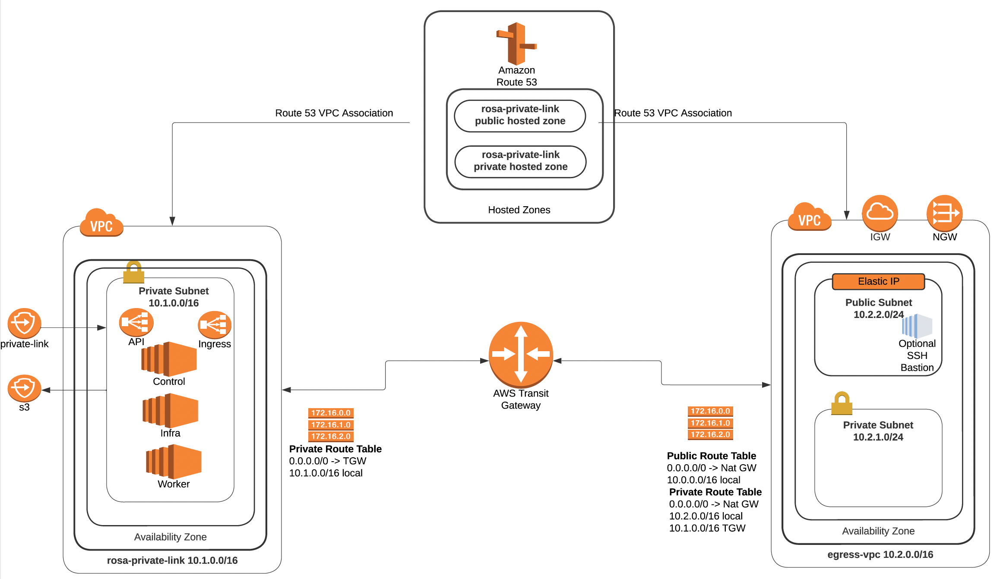

# Using Terraform to build ROSA cluster with Private Link enabled and STS

Red Hat Openshift Service on AWS (ROSA) is a fully-managed turnkey application platform. A ROSA cluster can be created without any requirements on public subnets, internet gateways, or network address translation (NAT) gateways. In this configuration, Red Hat uses AWS PrivateLink to manage and monitor a cluster in order to avoid all public ingress network traffic.

To deploy Red Hat OpenShift Service on AWS (ROSA) into your existing Amazon Web Services (AWS) account, Red Hat requires several prerequisites to be met. There are several [requirements ](https://docs.openshift.com/rosa/rosa_planning/rosa-sts-aws-prereqs.html#rosa-sts-aws-prereqs), [Review AWS service quota](https://docs.openshift.com/rosa/rosa_planning/rosa-sts-required-aws-service-quotas.html#rosa-sts-required-aws-service-quotasr) and [enable ROSA in your AWS accoun Access](https://docs.openshift.com/rosa/rosa_planning/rosa-sts-setting-up-environment.html#rosa-sts-setting-up-environment).


NOTE: STS(secure token service) allows us to deploy ROSA without needing a ROSA admin account, instead it uses roles and policies with Amazon STS to gain access to the AWS resources needed to install and operate the cluster.

In this series we use Terraform to provision all resources in AWS to deploy a ROSA cluster with Privatelink and STS.

## Create the AWS Virtual Private Cloud (VPCs), Pub/Private Subnets and TGW 

This terraform script provision 2 VPCs and 3 subnet and 1 bastion host as follows.




## Setup

Using the code in the repo will require having the following tools installed:

- The Terraform CLI
- The AWS CLI
- The ROSA CLI
- The OC CLI

update Terraform var file and run the script
```
terraform init
terraform apply -auto-approve
```

use subnet id from Terraform output to deploy ROSA cluster

## Deploy ROSA

1. Create ROSA cluster in the private subnet

    ```bash
    rosa create cluster --private-link --sts --mode auto -y \
      --cluster-name=$ROSA_CLUSTER_NAME \
      --machine-cidr=10.1.0.0/16 \
      --subnet-ids=<subnet ID from Terraform output>
    ```

## Test Connectivity

 
1. Create a ROSA admin user and save the login command for use later

    ```
    rosa create admin -c $ROSA_CLUSTER_NAME
    ```

1. Note the DNS name of your private cluster, use the `rosa describe` command if needed

  ```
  rosa describe cluster -c private-link
  ```

1. update /etc/hosts to point the openshift domains to localhost. Use the DNS of your openshift cluster as described in the previous step in place of `$YOUR_OPENSHIFT_DNS` below

    ```
    127.0.0.1 api.$YOUR_OPENSHIFT_DNS
    127.0.0.1 console-openshift-console.apps.$YOUR_OPENSHIFT_DNS
    127.0.0.1 oauth-openshift.apps.$YOUR_OPENSHIFT_DNS
    ```


1. Use public IP address from Terraform output to connect to bastion host. SSH to that instance, tunneling traffic for the appropriate hostnames. Be sure to use your new/existing private key, the OpenShift DNS for `$YOUR_OPENSHIFT_DNS` and your jump host IP for `$YOUR_EC2_IP`

    ```bash
      sudo ssh -i PATH/TO/YOUR_KEY.pem \
      -L 6443:api.$YOUR_OPENSHIFT_DNS:6443 \
      -L 443:console-openshift-console.apps.$YOUR_OPENSHIFT_DNS:443 \
      -L 80:console-openshift-console.apps.$YOUR_OPENSHIFT_DNS:80 \
       ec2-user@$YOUR_EC2_IP
    ```

1. Log into the cluster using oc login command from the create admin command above. ex.

    ```bash
    oc login https://api.private-test.3d1n.p1.openshiftapps.com:6443 --username cluster-admin --password GQSGJ-daqfN-8QNY3-tS9gU
    ```

1. Check that you can access the Console by opening the console url in your browser.


## Cleanup

1. Delete ROSA

    ```bash
    rosa delete cluster -c $ROSA_CLUSTER_NAME -y
    ```
   
1. Delete AWS resources

    ```bash
    terraform destroy -auto-approve
    ```
